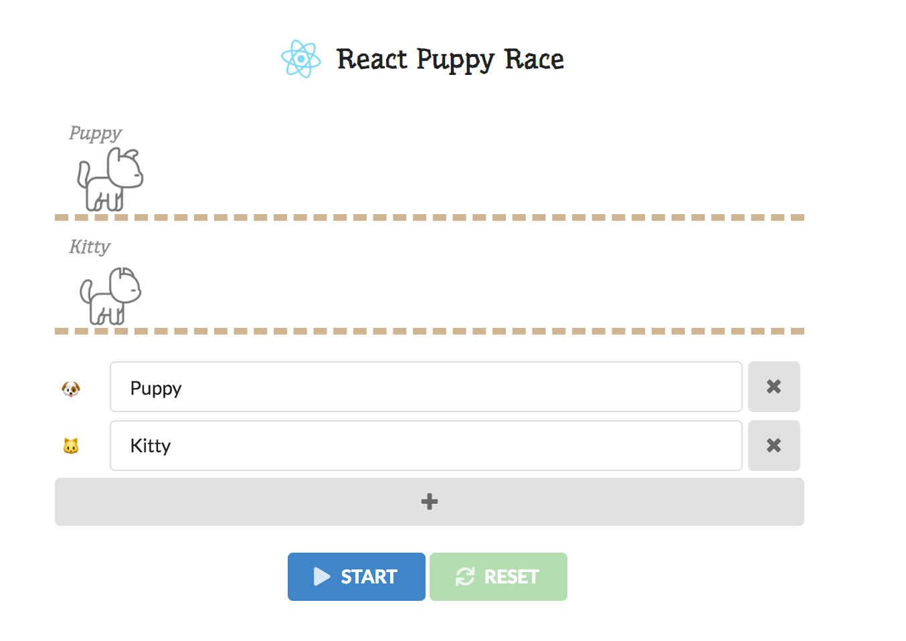

# REACT PUPPY RACE

A tiny puppy race game written in React  
Useful when playing lottery games with your friends

## Goal

- [React](https://reactjs.org/) w/o state management library
- [Progressive Web App](https://developers.google.com/web/fundamentals/codelabs/your-first-pwapp/?hl=ko) for offline use

## Credit

- [Lodash](https://lodash.com/) for rapid development
- [Final Form](https://github.com/final-form/final-form) for building roster form
- [Semantic UI](https://semantic-ui.com) for basic ui styling
- Dog and cat image: [BFF's](https://dribbble.com/shots/2157574-BFF-s) by [R A D I O](https://dribbble.com/madebyradio)
